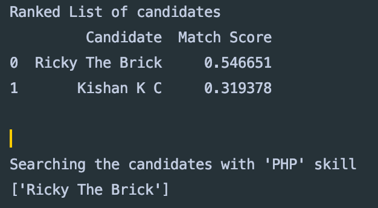

# Find Candidates for the Job

Data folder stores the job description and resumes for the applicants.
There are two candidates: 
1. Ricky The Brick
2. Kishan K C

class `FindCandidates` in `Main.py` parses the description of the job and the resumes of the applications.
Using the information, it computes the cosine similarity between job requirements and candidates' skills.
`rank_candidates` method of class  `FindCandidates` ranks the list of candidates in the decreasing order of match (cosine similarity).
`search_candidates` method of class `FindCandidates` takes a `keyword` and returns the names of candidates. 

# Demo
